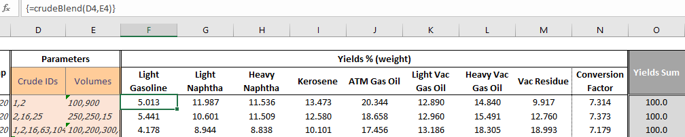

# Creating a function in Excel VBA
This documentation describes the required steps to create a function in Excel that will:
+ receive input (as range)
+ build the API call using the input variables
+ receive API results, parse JSON, and return Yields % for each product in separate cells

## Requirements
There are some extra steps required when working with VBA to allow it to accept the following:
1. Send/receive URL REQUEST
1. Parse JSON (additional open-source module)

#### Activate native Tools
Under the VBA editor: `Tools` > `References`
Make sure to check the following *Available References*:
+ `Microsoft XML, v6.0` (send URL request)

#### Add external Module
In order to parse JSON, it is required to install an additional open-source module: [VBA-JSON](https://github.com/VBA-tools/VBA-JSON)

+ Go to the [latest releases](https://github.com/VBA-tools/VBA-JSON/releases) and download the latest zip
+ Extract the contents
+ From the VBA editor, select `File` > `Import File` and select the extracted `JsonConverter.bas` file

> Note: the macro-enabled spreadsheet file will be self-sufficient, containing all the necessary modules/code

### Usage Example
The created function, `crudeBlend()`, requires two lists of parameters:
+ **Crude Identifiers**: list of Crude IDs, from the Crude Assay db, separated by comma
+ **Crude Volumes** (or Proportion): list of volume for each respective Crude, separated by comma

##### Known Limitation
Since the results will be stored in a sequence of cells (i.e. B2:F2), it is necessary to execute it as a **Matrix Function**.
+ With the selected input, select the range of cells that will hold the results
+ Press `Ctrl` + `Shift`  + `Enter` to execute as vectorized function (notice the curly brackets)

> Note: later on, users can just expand the formula by dragging simply it down

